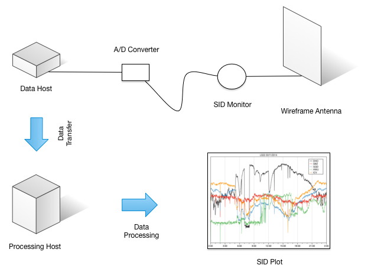

# SID Processing

## SID Data Transfer and Processing

To process SID data you want to download your data from your data host to the local raw data directory.

    $ cd <Your SID Workspace>
    $ Scripts/sid_synchronize.sh -h sid -u pi
 
Create anaytical and baseline data for all raw data files not yet processed.

    $ Scripts/sid_process_data.sh
    
## SID Data Extraction and Reporting

Carefully inspection of SID plots gives a list of SID signals. Once a month I create a SID report from the SID signal data stored in a Numbers spreadsheet. This two steps are out of scope of this project.

## Directory Structure

- **Analytical Data** Directory for analytical data files process from raw data, one file per day. File names are of format "STATION_YEAR-MONTH-DAY.csv". Columns are
    + **time** Time of measurement (YYYY-MM-DD hh:mm:ss)
    + **station** Letter code of the VLF transmitter.
    + **signal** Signal strength.
- **Baseline Data** Directory for baseline data files process from raw data, one file per day. File names are of format "STATION_YEAR-MONTH-DAY.csv". Columns are
    + **time** Time of measurement (YYYY-MM-DD hh:mm:ss)
    + **station** Letter code of the VLF transmitter.
    + **signal** Signal strength.
    + **weight** 1
- **Code** R code.
- **Raw Data**  Directory for raw data files, one file per day. File names are of format "STATION_YEAR-MONTH-DAY.csv". Columns are signal strengths of VLF transmitter as defined in header rows.
- **Scripts** Directory for shell scripts.