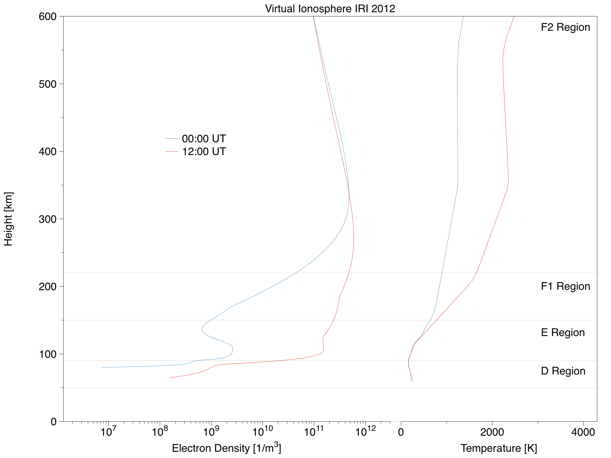
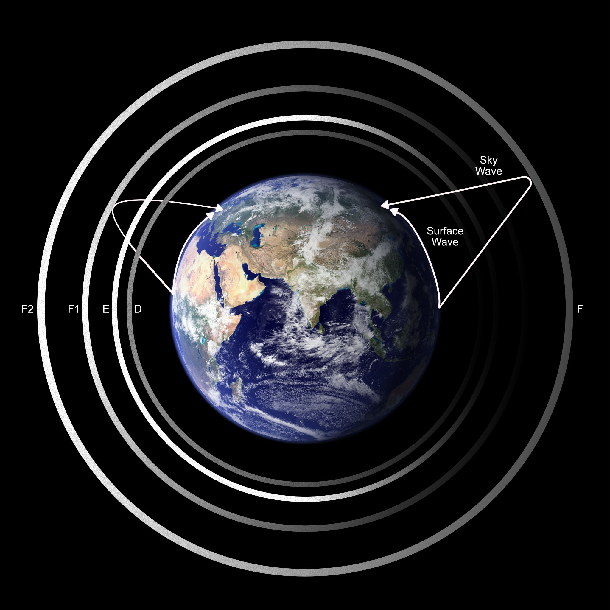
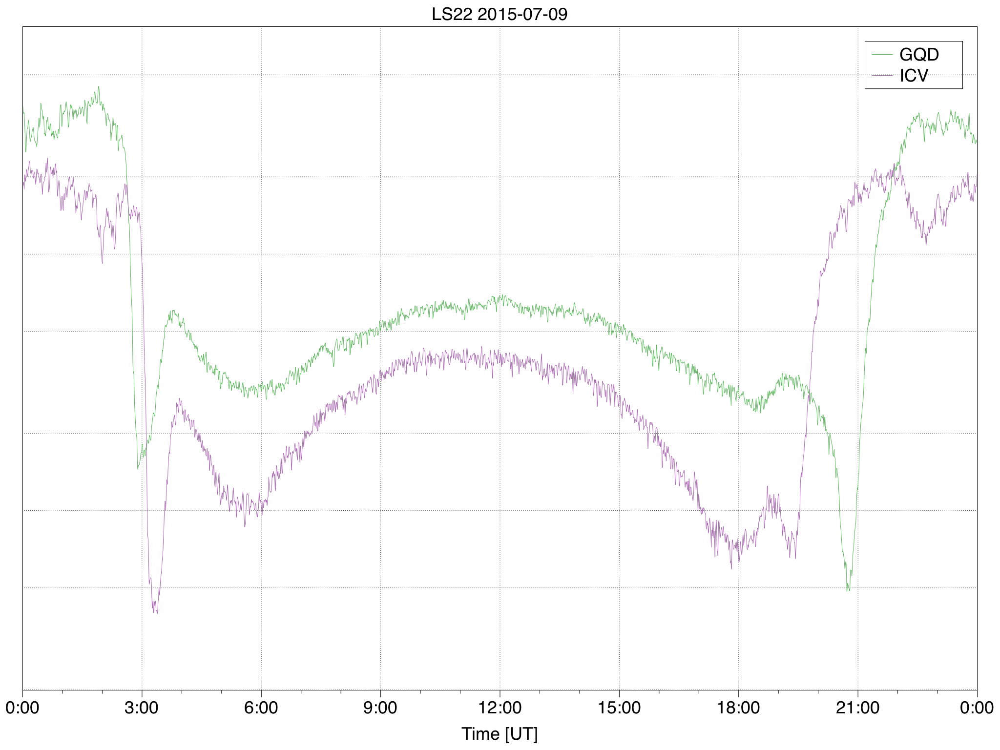

# SID Signal Processing

This project is about getting a metric for solar acivity by detection of [Sudden Ionospheric Disturbance](https://www.aavso.org/solar-sids) (SID).

## Introduction

During day time the sunlight (extreme UV and X-ray) ionizes atoms and molecules in the ionosphere, in the night the ions and electrons recombine. This is why we find electron density is raised during the day and lowered in the night for the D, E, and  for the F1 region of the ionosphere.

Plot of electrons density and temperature versus height of a virtual ionosphere (IRI 2012) at 0:00 (blue line) and 12:00 UT (red line). Data of the reference ionosphere (IRI-2012) by NASA.

During the day a VLF transmitter sky wave is partly absorbed by the D and E layers and reflected by the F1 layer. In the night the it gets its way to the F1 and F2 combined F layer where it’s reflected. At the receiver site the sky wave interferes with the surface wave resulting in the final VLF transmitter signal strength, this is true for day and night time.

A VLF transmitter signal on the day side is partially absorbed by the E and D layers and reflected by the F1 layer. While on the night side the E, D, and F1 layers don’t exist and so the signal is reflected by the F2 layer. Image of Earth “The Blue Marble” by NASA.

A plot of the VLF transmitter signal strength for 24 hours shows therefore a typical diurnal day/night pattern. Depending on the geographical positions of the VLF transmitters and the receiver site the night/day and day/night patterns show up at different points in time.

VLF transmitter signal for GQD (green) and ICV (purple) showing a typical diurnal day/night pattern.

A flare on the Sun dramatically impacts the ionization of D layer and its electron density may be raised by up to two magnitudes. So the sky wave is suddenly not longer absorbed but reflected by the D layer and the signal strength of the VLF transmitter changes dramatically. It gets higher or lower depending on the phase change between the two waves.

VLF transmitter signal for GQD (green) and ICV (purple). ICV was offline from 09:30 to 10:45 UT. Three solar events (#8690, #8700, and #8740) are visible.

To collect SID data I use an 1 m x 1 m wireframe antenna, a SuperSID monitor from Stanford Solar Center as amplifier, a cheap and simple USB A/D converter, and a Raspberry Pi as data host running 7/24. The SuperSID software samples the data from USB A/D converter over 5 seconds, filters it for VLF transmitter frequencies, and finally writes it to daily files. 

## Data Transfer and Processing

To process SID data for my site (LS22) I first download it from Raspberry Pi data host (sidpi) to my local raw data directory

    $ cd ~/Workspace/sid-signal-processing
    $ Scripts/sid_synchronize.sh -s LS22 -h sidpi -u sid
 
Create anaytical and baseline data for all raw data files not yet processed

    $ Scripts/sid_process_data.sh
    
## Data Extraction and Reporting

Inspection of SID plots gives me a list of SID signals I store in a spreadsheet. Once a month I perform a simple workflow to create a SID report for AAVSO from the SID signal data stored in this spreadsheet:

1. Export spreadsheet as CSV to **Solar Activity** directory
1. Prepare AAVSO report
1. Create AAVSO report

e.g. for August 2016 the command sequence 

    $ Scripts/sid_prepare_aavso_report.py -i Solar\ Activity/SID\ Log-Table.csv -m 8 -y 2016 > A143.dat
    $ Scripts/sid_create_aavso_report.py A143.dat
    
results in one file per transmitter ready to send to AAVSO.

## Sunrise and Sunset

To understand the diurnal pattern of the signal strength of the VLF transmitter it is handy to know the time of sunrise and sunset 200 km above ground and halfway between the SID monitor and the VLF transmitter. 

To calculate the midpoints for the given SID monitor / VLF transmitter combinations I use a R script:

    $ R/sid_reflection_points.R

To get the sunrises and sunsets for all of these midpoints for November 2017 at an altitude of 200 km above ground I run the commands:

    $ Scripts/sid_from_dusk_till_dawn.py -E -n LS22DHO/2 -l 8.444759 -b 50.37837 -a 200 -y 2017 -m 11 
    $ Scripts/sid_from_dusk_till_dawn.py -E -n LS22GQD/2 -l 3.614605 -b 51.35747 -a 200 -y 2017 -m 11
    $ Scripts/sid_from_dusk_till_dawn.py -E -n LS22ICV/2 -l 9.473752 -b 44.29854 -a 200 -y 2017 -m 11 

## Directory Structure
  
- **Analytical Data** Directory for analytical data files process from raw data, one file per day. File names are of format "SITE_YEAR-MONTH-DAY.csv". Columns are
    + **time** Time of measurement (YYYY-MM-DD hh:mm:ss)
    + **station** Letter code of the VLF transmitter.
    + **signal** Signal strength.
- **Baseline Data** Directory for baseline data files process from raw data, one file per day. File names are of format "SITE_YEAR-MONTH-DAY.csv". Columns are
    + **time** Time of measurement (YYYY-MM-DD hh:mm:ss)
    + **station** Letter code of the VLF transmitter.
    + **signal** Signal strength.
    + **weight** 1
- **Legacy Data**  Directory for legacy data files, one file per day and transmitter. File names are of format "SITE_TRANSMITTER_YEAR-MONTH-DAY.csv". 
- **Output Data** Directory of plot files. File names are of format "SITE_YEAR-MONTH-DAY.png".
- **R** Directory for R code.
- **Raw Data**  Directory for raw data files, one file per day. File names are of format "SITE_YEAR-MONTH-DAY.csv". Columns are signal strengths of VLF transmitter as defined in header rows.
- **Scripts** Directory for shell/python scripts.
- **Solar Activity** Exported spreadsheet data.